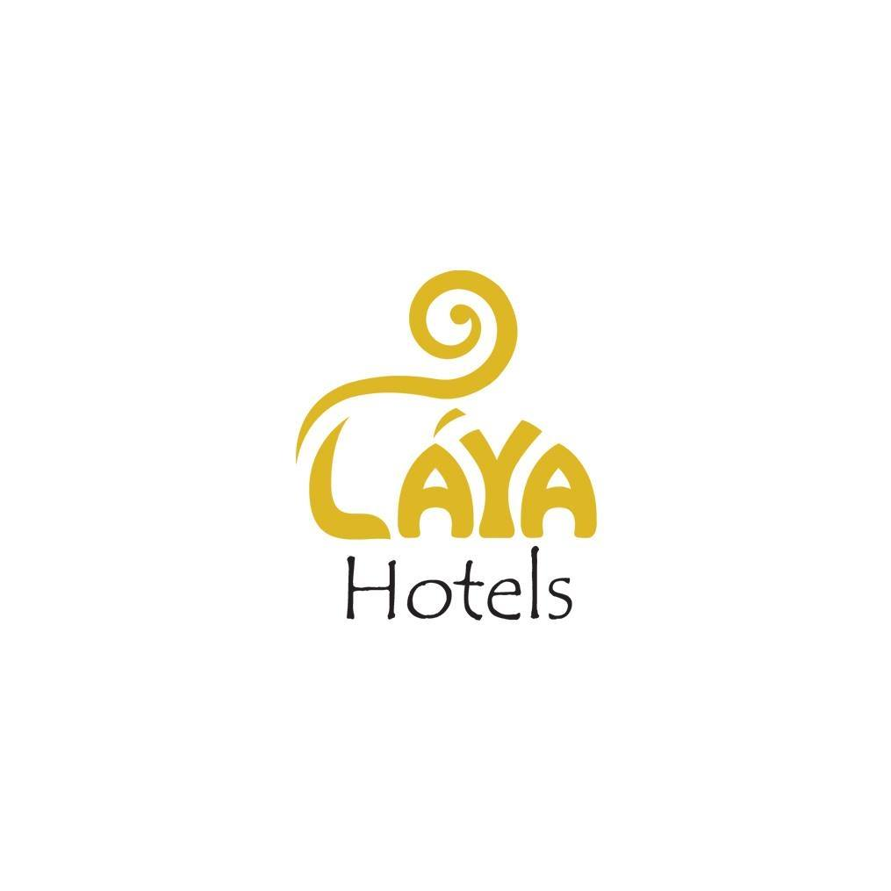
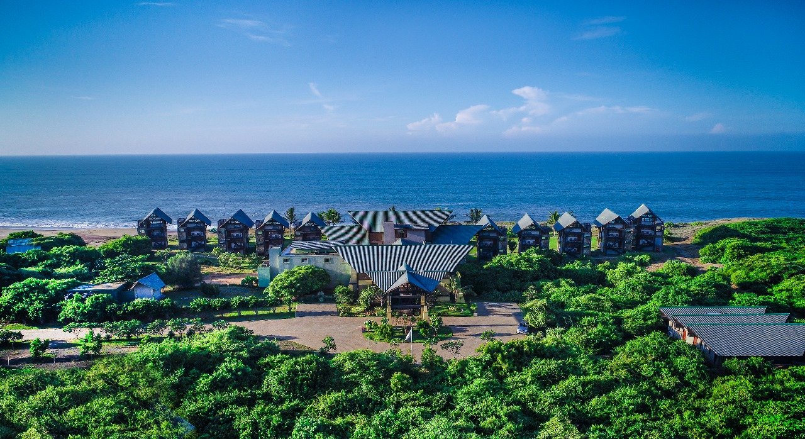

# 🏨 Laya Hotels – Official Multi-Hotel Website

Official website for the **Laya Hotels chain**, featuring:  
- 🌊 **Laya Beach**  
- 🐘 **Laya Safari**  
- 🌿 **Laya Leisure**  
- 🌊 **Laya Waves**

Built with **modern UI**, **responsive design**, and **hotel booking functionality**.

---

## 🎥 Website Demo

Even though the site is not live, here is a **preview/demo video**:

🎬 [Watch Website Demo](https://www.dropbox.com/scl/fi/oib8q0xqfffm3bterkq0f/laya.mp4?rlkey=pfnfmgax1uaie44rcix8t1663&st=rgh4u1q1&dl=0)  

---

## ✨ Key Features

- Multi-hotel platform with unified branding  
- Fully responsive design (desktop, tablet, mobile)  
- Interactive room listings & booking interface  
- Image galleries & promotions management  
- Admin panel for hotel management  
- Optimized UI/UX for hospitality  

---

## 🖥️ Technologies Used

| Frontend  | Backend | Database | Others |
|-----------|---------|---------|--------|
| HTML5, CSS3, JavaScript | PHP | MySQL | Bootstrap, Swiper.js, Font Awesome |
| Responsive Design | Admin Panel | Room Booking Logic | Git & GitHub |

---

## 🏨 Hotels Included

### 🌊 Laya Beach
  
Luxury beachfront hotel offering modern comfort and stunning views.

### 🐘 Laya Safari
  
Adventure and nature-focused hotel near wildlife attractions.

### 🌿 Laya Leisure
  
Peaceful retreat surrounded by greenery for relaxation and wellness.

### 🌊 Laya Waves
  
Elegant coastal hotel with premium amenities and modern facilities.

---

## 🔐 Admin Panel Features

- Manage rooms and room details  
- Upload & manage image galleries  
- Update pricing for weekdays, weekends, holidays  
- Manage promotions and services  
- Handle booking requests and inquiries  

> Media files (videos) are stored on the server and not included in GitHub for security and size optimization.

